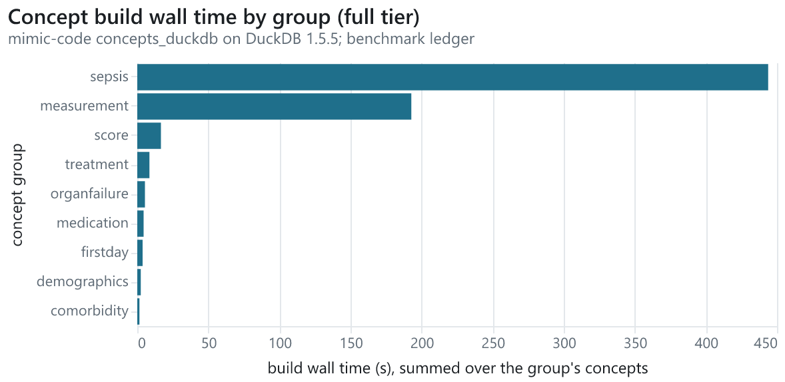
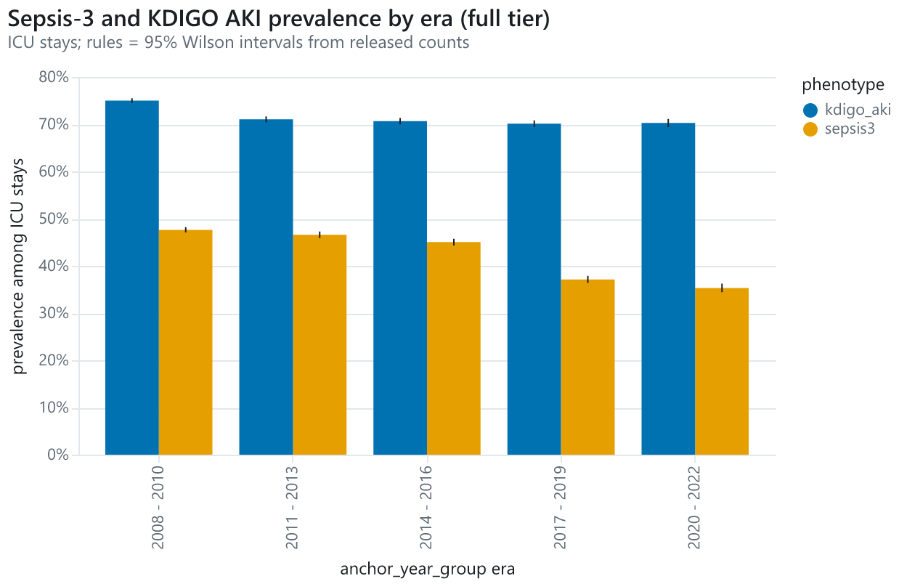

# 01 - Concepts and QC: the P3 concept layer, its data quality and the first phenotypes (Capstone #1)

> Written at EP-53 from the full-tier report run `20260917T213458Z-3f1556` (the
> `analyses.c01_concepts_qc` DAG step, launched as the background job `ep53-capstone`).
> Every table and figure this note embeds lives in [`01-concepts-and-qc/`](01-concepts-and-qc/)
> beside its `.disclosure.json` sidecar, written there only through the disclosure gate
> (`python -m mimicwarehouse.analyses.c01_concepts_qc promote --run <run_id>`, the
> programmatic `mwh disclose check --write-sidecar`): the run's CSV tables are promoted
> **as Markdown tables** (integers thousands-separated, hidden cells `<11`; the CSV and
> Parquet twins stay in the run folder because committed CSVs are refused by the guard by
> design - owner decision at EP-53), the figures as their Vega-Lite spec + PNG. This file's
> own sidecar is written by `... check-doc`. Regenerate the numbers with the commands under
> **Reproduction**; the tables below were pasted from `... tables` / `... summary`.

**Claim type: exploratory (concepts and data quality).** MIMIC-IV analyses are retrospective.

*Reader guide (DS/ML):* what it took to make 65 upstream SQL concepts run on DuckDB 1.5.5
with count-pins and patches, how the derived layer scales from the 100-patient demo to the
full 364,627-patient dataset, where the source tables are dirty, and how three phenotype
definitions behave across the anchor-year eras - every number k-suppressed, audited and
reproducible from a run id.
*Reader guide (clinical informatics):* which mimic-code concepts and phenotype definitions
(type 2 diabetes, sepsis-3, KDIGO acute kidney injury) this lab adopted, how often they
flag, how that changes across the 2008-2022 eras, and the data-quality caveats
(back-charted timestamps, unit strings, implausible values) that bound any reading of them.

**For ML/DS readers:** start with [Concept layer](#concept-layer) (timings, rows per tier,
pins) and [Data quality](#data-quality) (what the QC checks caught), then the
[Measurement process teaser](#measurement-process-teaser) for the charting patterns a
model-ready dataset inherits (EP-102). **For clinical-informatics readers:** start with
[Phenotypes](#phenotypes) (definitions, prevalence by era, the sepsis 2x2) and
[What it deliberately does not claim](#what-it-deliberately-does-not-claim); the concept
inventory and the QC tables are the provenance behind those numbers.

Headline numbers (ICU stays on the full tier; the promoted
[`phenotype_prevalence.md`](01-concepts-and-qc/phenotype_prevalence.md)):

<!-- headline:begin -->
| phenotype | positive / units | prevalence |
|---|---|---|
| sepsis3 (icustay) | 41,296 / 94,458 | 43.7 % |
| kdigo_aki (icustay) | 67,981 / 94,458 | 72.0 % |
<!-- headline:end -->

## Question

What did phase P3 build on top of the staged lake - which upstream concepts run, at what
cost, with which patches; what the data-quality profile says about the tables those
concepts read; and how the first three phenotype definitions behave overall and by
anchor-year era - and does every one of those numbers reproduce from a recorded run id
after k = 11 suppression?

## Data & tiers

- **Tiers** (DESIGN section 4, D-18): `fixture` (the committed synthetic generator, ids
  >= 90 000 000; the tier every test runs on), `demo` (MIMIC-IV Demo 2.2, 100 patients,
  ODbL; the count-pin reference), `dev` (5 % of subjects, `subject_id % 100 < 5`) and
  `full` (every subject). The narrative below is the **full** tier; the concept inventory
  carries the demo and dev row counts beside it.
- **Snapshot ids** the report run cites: core
  `b1fc53134348f3b4ede369ed6ae27424c4988fafb45065c87a09907f7a410eca` (unchanged since
  the P2 staging, [00-staging-benchmark.md](00-staging-benchmark.md)); derived
  `61c3129961c837efbe30c07a182578f11581e78dcea8445db7a0d2798ee02b2f`; the demo and dev
  catalogs read for the inventory, `core.demo`
  `f38696a8aebd6d6d487dc206e5bf15302cf2e9b2ed944d18d2d3c639fa6c496b` and `core.dev`
  `f830b941fc2d8ec7548ee9f9bb26b5ae9d89fd28def42b5761f4c127cb92ee4c`.
- **Runs the tables are read from** (all full tier): the concept builds
  `20260906T003510Z-9564c0` (EP-37, 53 concepts) and `20260906T154530Z-fca779` (EP-38, the
  12 patched or dependent concepts rebuilt); the unit-curation build
  `20260906T230902-full-46e84a6` (EP-39); the phenotype runs `20260906T231017Z-69287e`
  (t2dm@1.0.0, EP-41), `20260907T001156Z-99ba05` (sepsis3@1.0.0) and
  `20260907T001156Z-c09262` (kdigo_aki@1.0.0, both EP-42), `20260916T203433Z-28a895`
  (sepsis_explicit@1.1.0, EP-172); the QC run `20260915T011113Z-4b675d` (EP-44); the
  measurement-process run `20260916T194157Z-25a7ea` (EP-45); this report,
  `20260917T213458Z-3f1556`.
- MIMIC-IV analyses are retrospective. Dates are shifted per patient, so the only
  cross-patient temporal axis is `anchor_year_group` (five 3-year eras); ages >= 89
  appear as 91.

## Method

The report run opens `run.start(kind="report")` (EP-35) and reads **published
aggregates only**: the registry tables `meta.concept_versions`, `meta.qc_checks`,
`meta.item_unit_variants` and `meta.item_units` through the audited safe-query gate
(EP-30; 14 statements, 14 audit ids on the manifest), the phenotype views through EP-42's
summary helpers (subject-keyed count-family reads, k = 11 row-wise), the benchmark ledger
for wall time and peak RSS, and - because no published table carries the first-24 h
measurement share by era - EP-45's raw structural slice (itemid x care unit x era, data
root only), summed per item and era and k-suppressed here with the same primitive the
published `meta.mp_*` tables went through. Every table then passes `disclose.suppress`
(table mode, complementary over its label columns; nested totals such as units / positives
handled by the primitive) and `disclose.check_frame` before it is written; shares, ratios
and 95 % Wilson intervals (statsmodels) are computed in Python from **released** counts
and blank beside a hidden one. Figures are Altair charts with the EP-5 theme merged at
serialisation and aggregates only under `data.values`, rendered to PNG by
`vl-convert-python`. Promotion into this folder re-checks every copy and writes its
sidecar. The full-tier run took 4.0 s of wall (the concepts, QC and phenotypes it
summarises were built by the runs listed above); the machine and engine facts are those of
[00-staging-benchmark.md](00-staging-benchmark.md).

## Concept layer

**What was adopted.** All 65 `concepts_duckdb` files of the vendored mimic-code pin
(upstream commit `8bcbd190ca75670cd5281f9ead3611ae1cefb73e`, EP-8) run on DuckDB 1.5.5
on every tier, in nine groups, with the `mimiciv_derived` schema as their session view
(EP-37). **What was patched.** Five concepts carry a full-replacement port of an open
upstream pull request (EP-38; the registry pins the vendored commit, so a re-vendor
refuses every concept build until each patch is reviewed): `complete_blood_count`
(`complete_blood_count-mchc-unit-pr2141`), `inflammation`
(`inflammation-crp-unit-pr2141`), `charlson` (`charlson-c4a-exclusion-pr2142`), `apsiii`
(`apsiii-equidistant-arms-pr2137`) and `sirs` (`sirs-wbc-guard-pr2146`). **Deviations
from upstream** and the adopt / port / ignore verdict per concept are in
[docs/resources/concepts.md](../resources/concepts.md).

**Inventory by group** (from [`concept_inventory.md`](01-concepts-and-qc/concept_inventory.md):
concept, group, upstream commit, patch id, status, rows on demo / dev / full, wall time and
peak RSS of the full-tier build from the benchmark ledger; 65 rows):

| group | # concepts | wall s | slowest concept s | max peak RSS MB | rows demo | rows dev | rows full |
|---|---|---|---|---|---|---|---|
| sepsis | 2 | 443.8 | 442.8 | 1,107 | 965 | 49,658 | 991,197 |
| measurement | 18 | 192.8 | 159.7 | 7,480 | 68,569 | 2,640,070 | 53,822,395 |
| score | 6 | 16.6 | 12.7 | 7,081 | 12,955 | 423,053 | 8,688,074 |
| treatment | 5 | 8.6 | 5.0 | 1,250 | 6,528 | 192,629 | 5,181,433 |
| organfailure | 4 | 5.4 | 2.8 | 1,827 | 17,458 | 497,888 | 10,133,576 |
| medication | 14 | 4.5 | 2.4 | 636 | 6,619 | 189,548 | 3,851,347 |
| firstday | 10 | 3.8 | 1.4 | 1,614 | 1,400 | 46,720 | 944,580 |
| demographics | 5 | 2.5 | 1.2 | 535 | 16,748 | 566,341 | 11,619,064 |
| comorbidity | 1 | 1.5 | 1.5 | 312 | 275 | 27,263 | 546,028 |



*Figure 1 - concept build wall time by group on the full tier, summed over each group's
concepts (spec: [`concept_wall_by_group.vl.json`](01-concepts-and-qc/concept_wall_by_group.vl.json)).*

The whole derived layer is 95,777,694 rows on full (4,633,170 on dev, 131,517 on demo)
built in 679.4 s of concept wall time, and that time is two concepts: `suspicion_of_infection`
(442.8 s, the antibiotic x culture window join; 65 % of the total) and `rhythm` (159.7 s at
the 7,480 MB peak RSS, a chartevents scan). Everything else finishes in under 13 s (`sofa`
12.7 s at 7,081 MB, `vitalsign` 10.2 s at 3,702 MB, `rrt` 5.0 s), and 55 of the 65 concepts in
under 2 s. Note the derived-layer sum here (95,777,694) differs from the 95,777,751 rows
EP-38's completion note recorded after the patched rebuild; the derived snapshot id above is
the authority and the 57-row reconciliation is handed to EP-54.

**Demo count-pins vs the full tier** ([`demo_pins_vs_tier.md`](01-concepts-and-qc/demo_pins_vs_tier.md)).
The committed demo pins (`tests/ep/pins/concepts_demo.json`, EP-37/38) match the live demo
counts for **65 of 65** concepts, so the build that produced this note reproduces the
build that pinned them. The full-to-demo ratio, computed from released counts, is 674.7 for
every ICU-stay-grain concept (94,458 stays / 140 in the demo) and 1,985.6 for the
admission-grain ones (546,028 / 275); it ranges from 233.3 (`dobutamine`) and 335.0
(`phenylephrine`) - the demo's 100 patients over-represent vasopressor exposure - to
4,147.9 (`inflammation`: CRP is drawn far less often in the demo's era mix); `neuroblock`
has no demo rows (pin 0, 19,430 on full) and no ratio. The median over the 64 concepts with
a ratio is 674.7.

## Data quality

**Checks by status** ([`qc_status_by_table.md`](01-concepts-and-qc/qc_status_by_table.md);
the EP-44 profile of the 31 staged tables against `qc/thresholds.yaml`, full qc run
`20260915T011113Z-4b675d`): **574 checks - pass 491 / warn 83 / fail 0**; 19 of the 31
tables carry at least one warning, none a failure. The warnings concentrate in the
medication chain (`emar_detail` 29, `microbiologyevents` 12, `pharmacy` 9) and are, with
two exceptions below, near-empty optional columns (`null_share` at or above 99.8 %).

**Top warnings** ([`qc_top_checks.md`](01-concepts-and-qc/qc_top_checks.md); failures first,
then by the value-to-threshold ratio):

| status | check | table | column | metric | value | threshold | n_affected |
|---|---|---|---|---|---|---|---|
| warn | ts_order | mimiciv_hosp.pharmacy | stoptime | violation_share | 0.040 | 0.010 | 717,515 |
| warn | ts_order | mimiciv_hosp.prescriptions | stoptime | violation_share | 0.040 | 0.010 | 816,994 |
| warn | null_share | mimiciv_hosp.microbiologyevents | quantity | null_share | 1.000 | 0.500 | 3,988,041 |
| warn | null_share | mimiciv_hosp.emar_detail | continued_infusion_in_other_location | null_share | 1.000 | 0.500 | 87,353,240 |
| warn | null_share | mimiciv_hosp.emar_detail | infusion_rate_adjustment_amount | null_share | 0.999 | 0.500 | 87,318,554 |
| warn | null_share | mimiciv_hosp.pharmacy | expirationdate | null_share | 0.999 | 0.500 | 17,825,811 |
| warn | null_share | mimiciv_hosp.pharmacy | fill_quantity | null_share | 0.999 | 0.500 | 17,825,811 |
| warn | null_share | mimiciv_hosp.prescriptions | form_rx | null_share | 0.999 | 0.500 | 20,267,164 |
| warn | null_share | mimiciv_hosp.emar_detail | restart_interval | null_share | 0.999 | 0.500 | 87,251,802 |
| warn | null_share | mimiciv_hosp.emar_detail | non_formulary_visual_verification | null_share | 0.998 | 0.500 | 87,222,009 |

The two that matter for analysis: **4.0 % of pharmacy and prescription orders stop before
they start** (`stoptime < starttime`, 717,515 and 816,994 rows) - an ordering artefact any
exposure window over medication orders must clip or drop (EP-86) - and the store lag below.

**Unit variants of the curated itemids**
([`unit_variants.md`](01-concepts-and-qc/unit_variants.md); the EP-39 catalogue's 63 items
over `meta.item_unit_variants`): 16 items are flagged. Fourteen labs (bicarbonate, calcium,
chloride, creatinine, glucose, magnesium, phosphate, potassium, sodium, urea nitrogen,
hematocrit, hemoglobin, platelets, white cells) carry a second unit string whose row count
is below k - the null-unit rows the harmoniser treats as the canonical unit - with the
canonical string at a dominant share of 1.000; two chartevents glucose items carry two
real strings (`Glucose (serum)` dominant share 0.991, `Glucose (whole blood)` 0.915). Height
(226707) is charted in inches (dominant string `Inch`, canonical cm; `mwh_harmonize`
converts it), and INR, the GCS components, FiO2 and the lbs admission weight carry no unit
string at all, which the catalogue expects.

**Implausible values** ([`implausible_values.md`](01-concepts-and-qc/implausible_values.md);
share of numeric rows outside the catalogue's inclusive bounds after unit conversion): the
only warnings are the two GU irrigant volumes (`GU Irrigant/Urine Volume Out` 1.4 %,
`GU Irrigant Volume In` 1.3 % outside 0..5000 mL); every other curated item is at or below
0.6 % (height 0.6 %, FiO2 0.4 %, daily weight 0.3 %), and 16 lab items have fewer than 11
implausible rows on the whole full tier.

**Timestamp ordering** ([`timestamp_ordering.md`](01-concepts-and-qc/timestamp_ordering.md)):
besides the 4.0 % order inversions above, `outputevents` is back-charted (`storetime <
charttime`) for **14.1 %** of rows (757,757; the one store-lag warning), `chartevents` for
8.4 % (36,530,969 rows, under the 10 % warning line), `datetimeevents` for 4.6 % and `emar`
for 3.4 %; `admissions` has 26 rows with a death time before the admission time (0.2 % of
deaths) and 175 with a discharge before the admission; fewer than 11 rows violate the
`edregtime <= edouttime`, transfers `intime <= outtime` and inputevents `starttime <=
endtime` rules. **How to read `meta.qc_*`:** every check is a named function returning
aggregates (`n_affected` counts rows, never samples them), `n_affected` below k is
blanked with `n_affected_suppressed = true`, and the thresholds, the four tables and the
dictionary-coded columns are documented in [docs/methods/qc.md](../methods/qc.md); `mwh qc
status --tier full` prints the same summary.

## Phenotypes

**Definitions** - the cards, criteria trees, evidence columns and the concept pins are in
[docs/methods/phenotypes.md](../methods/phenotypes.md) (EP-41/42): `t2dm@1.0.0`
(subject grain: diagnosis codes, HbA1c, glucose-lowering medication over the reviewed
code set, EP-172), `sepsis3@1.0.0` (ICU-stay grain: the mimic-code `sepsis3` concept -
suspected infection plus a SOFA rise - as a concept leaf pinned to the executed SQL),
`kdigo_aki@1.0.0` (ICU-stay grain: KDIGO stage >= 1 on the smoothed
`kdigo_stages` concept within 168 h of ICU admission) and, for the 2x2,
`sepsis_explicit@1.1.0` (admission grain: explicit sepsis diagnosis codes, the EP-172
reviewed set).

**Prevalence overall and by era**
([`phenotype_prevalence.md`](01-concepts-and-qc/phenotype_prevalence.md); the unit is the
phenotype's grain overall and the admission (`hadm`) by era for the subject-grain t2dm -
an admission counts as prevalent when the subject's onset lies at or before its discharge):

| phenotype | scope | unit | units | positive | prevalence | 95 % Wilson |
|---|---|---|---|---|---|---|
| t2dm | all | subject | 364,627 | 49,599 | 13.6 % | 13.5 - 13.7 |
| t2dm | 2008 - 2010 | hadm | 227,719 | 72,568 | 31.9 % | 31.7 - 32.1 |
| t2dm | 2011 - 2013 | hadm | 114,880 | 29,312 | 25.5 % | 25.3 - 25.8 |
| t2dm | 2014 - 2016 | hadm | 91,088 | 21,583 | 23.7 % | 23.4 - 24.0 |
| t2dm | 2017 - 2019 | hadm | 69,850 | 15,922 | 22.8 % | 22.5 - 23.1 |
| t2dm | 2020 - 2022 | hadm | 42,491 | 9,337 | 22.0 % | 21.6 - 22.4 |
| sepsis3 | all | icustay | 94,458 | 41,296 | 43.7 % | 43.4 - 44.0 |
| sepsis3 | 2008 - 2010 | icustay | 30,002 | 14,288 | 47.6 % | 47.1 - 48.2 |
| sepsis3 | 2011 - 2013 | icustay | 19,475 | 9,072 | 46.6 % | 45.9 - 47.3 |
| sepsis3 | 2014 - 2016 | icustay | 18,136 | 8,165 | 45.0 % | 44.3 - 45.7 |
| sepsis3 | 2017 - 2019 | icustay | 16,048 | 5,958 | 37.1 % | 36.4 - 37.9 |
| sepsis3 | 2020 - 2022 | icustay | 10,797 | 3,813 | 35.3 % | 34.4 - 36.2 |
| kdigo_aki | all | icustay | 94,458 | 67,981 | 72.0 % | 71.7 - 72.3 |
| kdigo_aki | 2008 - 2010 | icustay | 30,002 | 22,501 | 75.0 % | 74.5 - 75.5 |
| kdigo_aki | 2011 - 2013 | icustay | 19,475 | 13,832 | 71.0 % | 70.4 - 71.7 |
| kdigo_aki | 2014 - 2016 | icustay | 18,136 | 12,811 | 70.6 % | 70.0 - 71.3 |
| kdigo_aki | 2017 - 2019 | icustay | 16,048 | 11,252 | 70.1 % | 69.4 - 70.8 |
| kdigo_aki | 2020 - 2022 | icustay | 10,797 | 7,585 | 70.3 % | 69.4 - 71.1 |



*Figure 2 - sepsis-3 and KDIGO AKI prevalence among ICU stays by anchor-year era with 95 %
Wilson intervals from the released counts (spec:
[`phenotype_prevalence_by_era.vl.json`](01-concepts-and-qc/phenotype_prevalence_by_era.vl.json)).*

Three readings, all exploratory. **Sepsis-3 flags 43.7 % of ICU stays** and falls across
the eras from 47.6 % (2008 - 2010) to 35.3 % (2020 - 2022), a drop far outside the
intervals; the definition depends on culture orders and antibiotic starts (the
`suspicion_of_infection` window) and on SOFA components, all of which are charting
practices that changed with the MetaVision era and with ordering habits - so this is a
charting trend at least as much as a clinical one. **KDIGO AKI stage >= 1 within 168 h
flags 72.0 %** of stays and is flat at 70 - 75 % across eras; the smoothed stage combines
creatinine, urine-output and CRRT criteria, and the urine-output criterion over hourly
output charting is what makes it this common in an ICU population - it is a definition
prevalence, not an incidence. **Type 2 diabetes** is 13.6 % of all subjects; by admission
and era it runs from 31.9 % to 22.0 % - a per-admission rate over a population that is
older and sicker than the subject base, dominated by the 227,719 admissions of the
2008 - 2010 era, and falling as the later eras carry more single-admission subjects whose
onset evidence is thinner.

**KDIGO stage distribution** ([`kdigo_stage_distribution.md`](01-concepts-and-qc/kdigo_stage_distribution.md);
the maximum smoothed stage inside the 168 h window per stay):

| max stage in window | stays | share of released |
|---|---|---|
| 0 | 26,477 | 28.0 % |
| 1 | 16,152 | 17.1 % |
| 2 | 30,613 | 32.4 % |
| 3 | 21,216 | 22.5 % |

**Sepsis-3 vs explicit sepsis codes** ([`sepsis_agreement_2x2.md`](01-concepts-and-qc/sepsis_agreement_2x2.md);
per admission with at least one ICU stay, the icustay-grain sepsis-3 flag rolled up to the
admission against the reviewed explicit-code set):

| cell | admissions | share |
|---|---|---|
| both | 12,113 | 14.2 % |
| sepsis-3 only | 26,826 | 31.5 % |
| explicit codes only | 2,167 | 2.5 % |
| neither | 44,136 | 51.8 % |
| all | 85,242 | 100.0 % |

Sepsis-3 flags 45.7 % of these admissions, the explicit codes 16.8 %; 85 % of the coded
admissions are also sepsis-3 positive, but only 31 % of the sepsis-3 admissions are coded.
That asymmetry is the known gap between a physiological definition and billing codes, and
it is the reason EP-42 ships both rather than one.

## Measurement process teaser

Share of ICU stays with at least one measurement of the item in the first 24 h, by era,
for ten curated items ([`measurement_first24h_by_era.md`](01-concepts-and-qc/measurement_first24h_by_era.md);
from EP-45's structural slice summed over care units; stays per era 30,001 / 19,475 / 18,135 /
16,046 / 10,787). A hidden cell (`<11`) means the released count or its complement - the
stays *without* the item - lies below k:

| item | source | 2008 - 2010 | 2011 - 2013 | 2014 - 2016 | 2017 - 2019 | 2020 - 2022 |
|---|---|---|---|---|---|---|
| Heart Rate | chartevents | 99.7 % | <11 | <11 | <11 | <11 |
| Respiratory Rate | chartevents | 99.6 % | 99.9 % | 99.8 % | 99.6 % | 99.5 % |
| O2 saturation pulseoxymetry | chartevents | 99.6 % | 99.8 % | 99.8 % | 99.9 % | 99.7 % |
| GCS - Eye Opening | chartevents | 99.0 % | 99.3 % | 99.3 % | 99.4 % | 99.2 % |
| Non Invasive Blood Pressure mean | chartevents | 92.9 % | 91.5 % | 90.4 % | 91.5 % | 89.6 % |
| Temperature Celsius | chartevents | 6.4 % | <11 | <11 | <11 | <11 |
| Creatinine | labevents | 95.5 % | 95.7 % | 96.0 % | 95.0 % | 95.2 % |
| Potassium | labevents | 95.5 % | 95.7 % | 96.1 % | 95.0 % | 95.2 % |
| Hemoglobin | labevents | 94.7 % | 95.0 % | 95.4 % | 94.6 % | 94.7 % |
| Lactate | labevents | 50.0 % | 52.4 % | 56.4 % | 56.4 % | 55.1 % |

The vital signs are near-universal (heart rate is hidden from 2011 on precisely because
fewer than 11 stays per era lack it in the first day), the basic chemistry and blood count
are drawn for about 95 % of stays in every era, lactate rises from 50.0 % to 55 - 56 % of
stays, and the Celsius temperature item is rare after 2008 - 2010 because temperature is
charted in Fahrenheit (item 223761) at this hospital - a unit fact the EP-39 catalogue
converts and the QC unit-variant table confirms. Non-invasive mean pressure drifts from
92.9 % to 89.6 %, the arterial-line items taking its place. The full measurement-process
tables (hourly and daily grids, structural absence by care unit, informative presence) are
under `runs/20260916T194157Z-25a7ea/` (EP-45) and are not promoted here.

## What it deliberately does not claim

- **No clinical validation of the phenotypes.** `t2dm`, `sepsis3` and `kdigo_aki` are
  computable definitions over charted data; nothing here compares them with chart review,
  and their prevalence is the prevalence of the definition.
- **Counts reflect charting, not incidence.** A sepsis-3 flag needs a culture order and an
  antibiotic start; a KDIGO flag needs hourly urine output or serial creatinine; a
  measurement share is a charting share. What was not ordered or charted is invisible.
- **Era differences confound with coding and charting practice.** The eras are
  per-patient shifted 3-year windows; the switch to MetaVision, the ICD-9 to ICD-10
  transition (about 2015) and ordering habits move every trend above; no calendar-time
  claim follows.
- **No causal or predictive claim.** Nothing is modelled; the intervals are sampling
  intervals of a proportion, not effect estimates.
- **Not a data-quality verdict on MIMIC-IV.** The QC thresholds are this project's sanity
  windows (`qc/thresholds.yaml`); a warning marks something a cohort builder must handle
  explicitly, not an error in the source.
- **Timings are single runs on one laptop** (the benchmark ledger's latest line per step);
  the concept wall times mix DuckDB, the derived-layer design, Windows and two antivirus
  products.

## Reproduction

The runs this note reads (all launched through the EP-19 job runner on the full tier;
each is resumable and idempotent) and the report run itself:

```powershell
cd mimicwarehouse
uv run --group dev mwh build --tier full --tag concepts --background --job concepts-full        # EP-37/38
uv run --group dev mwh build --tier full --tag units --background --job units-full              # EP-39
uv run --group dev mwh build --tier full --tag phenotypes --background --job phenotypes-full     # EP-41/42/172
uv run --group dev mwh build --tier full --tag qc --background --job qc-full                    # EP-44
uv run --group dev mwh build --tier full --tag measurement --background --job measurement-full  # EP-45
uv run --group dev mwh build --tier full --select analyses.c01_concepts_qc --background --job ep53-capstone
uv run --group dev mwh jobs --job ep53-capstone --tail 20
uv run --group dev mwh runs list --kind report --tier full --last 1
uv run python -m mimicwarehouse.analyses.c01_concepts_qc promote --run <run_id>
uv run python -m mimicwarehouse.analyses.c01_concepts_qc tables
uv run python -m mimicwarehouse.analyses.c01_concepts_qc summary
uv run python -m mimicwarehouse.analyses.c01_concepts_qc check-doc
```

`mwh runs show <run_id>` lists the eleven tables and two figures of the report run; the
promoted tables in [`01-concepts-and-qc/`](01-concepts-and-qc/) are the run's
`tables/*.csv` rendered as Markdown (every value, marker and row) and the figures are
byte copies of `figures/*` (`test_ep53` re-parses the two headline numbers from the
Markdown and from the run's CSV). The block below is `run.reproduction_block` over the
report run's manifest (EP-35); the recorded command line is the job runner's argv.

Run `20260917T213458Z-3f1556` - kind `report`, tier `full`, status `ok`, started 2026-09-17T21:34:58.640+00:00.

```powershell
cd mimicwarehouse
cli.py build --tier full --select analyses.c01_concepts_qc --job ep53-capstone
```

- Recorded SQL: 14 statement(s) under `runs/<run_id>/sql/`; audited safe-query calls: 14; attrition steps: 0.
- Protocol: none (not run under a frozen protocol; EP-51).
- Seeds: none (no stochastic stage).
- Claim type: exploratory (concepts and data quality). MIMIC-IV analyses are retrospective.

## Provenance

- git `bd6482133c370679723086615e7ddf3c07b5b43b` (dirty: the EP-53 working tree before its
  commit) - package `0.1.0` - DuckDB `1.5.5` - Python `3.13.15`.
- Environment hash (`uv.lock` sha256): `aa614a0d27db4514d9a8825c6a6fdd4babebdbc0832251502d854984cbaa2282`.
- Snapshot ids: core `b1fc53134348f3b4ede369ed6ae27424c4988fafb45065c87a09907f7a410eca`; core.demo `f38696a8aebd6d6d487dc206e5bf15302cf2e9b2ed944d18d2d3c639fa6c496b`; core.dev `f830b941fc2d8ec7548ee9f9bb26b5ae9d89fd28def42b5761f4c127cb92ee4c`; derived `61c3129961c837efbe30c07a182578f11581e78dcea8445db7a0d2798ee02b2f`.
- Wall time 3.997441 s; peak RSS 335 MB (peak_wset); CPU time 4.734 s; disk delta 0.3 MB; GPU memory peak -.
- Build `20260917T213454-full-bd64821`, job `ep53-capstone` (`runs/jobs/ep53-capstone.log`).

## Limitations

- The per-era t2dm rows are per admission while the overall row is per subject; the two
  are not comparable and are shown together only because the era axis exists at the
  admission level (`mimiciv_derived.hadm_era`).
- A hidden teaser cell does not say which side is small (the measured count or its
  complement); the raw slice is in the data root, not here.
- The concept wall times are the latest ledger line per step, from builds on 2026-09-06
  under `Best performance`; a rebuild after a DuckDB or patch change re-measures them.
- The QC "top" ordering by value-to-threshold ratio ranks near-empty optional columns
  above the ordering inversions that matter more; the checks table keeps every row so a
  reader can sort otherwise.
- The demo pins are counts only (plus the Charlson mean); they prove the row counts
  reproduce, not the values.

## Next

P4 turns these tables into marts and pages: the first-day feature marts (EP-55) over the
`firstday` concepts and the curated itemids; the Catalog & QC browser (EP-61) over
`meta.qc_*`; the Phenotype Studio (EP-63) over the prevalence and agreement helpers used
here; the missing-data views (EP-72) over the EP-45 tables this note only teases. EP-54
(the P3 re-plan) takes the two open items: the 57-row derived-layer reconciliation against
EP-38's note and the at-risk-curve disclosure question (roadmap Risk 17).
